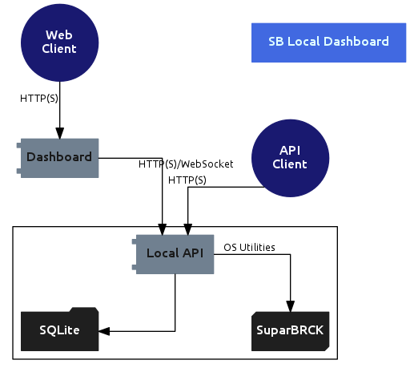

# SupaBRCK Local Dashboard

This dashboard implements a local view into the state of the SupaBRCK.

It is composed of two components:

- The API
- A web dashboard that consumes the API

## API

The API is developed using Flask and packaged for deployment on a SupaBRCK
using opkg.

The API documentation is built on Swagger and lives in `api-docs`

## Architecture

## Installation notes

Installation may be performed using `opkg`

`opkg install local-dashboard`

- This will set up the API, database and dashboard, the latter will be exposed at http://local.brck.com when accessed from within the SupaBRCK WiFi network.
- First-time use will require to change the password from the default credentials (admin/admin)

    You may also login using the device root user account and the associated password.

## Dependencies

These are the runtime dependencies installed via opkg.

    Note that python dependencies required by the API will be transformed into opkg packages.

- dnsmasq (this is already available on OpenWrt)
- supabrck-core
- python-brck-sdk
- connected_clients
- querymodem
- python-flask
- python-psutil
- python-gunicorn
- nginx

## Feature notes

- API 
    - See the API README: https://github.com/brck/local-dashboard/blob/master/api/README.md
- Frontend
    - [x] System State
    - [x] SIM Connection Management
    - [x] Power Management
    - [x] LAN Connection Management
    - [x] System version and packages view
    - [x] Diagnostics view
    - [ ] Historical views
